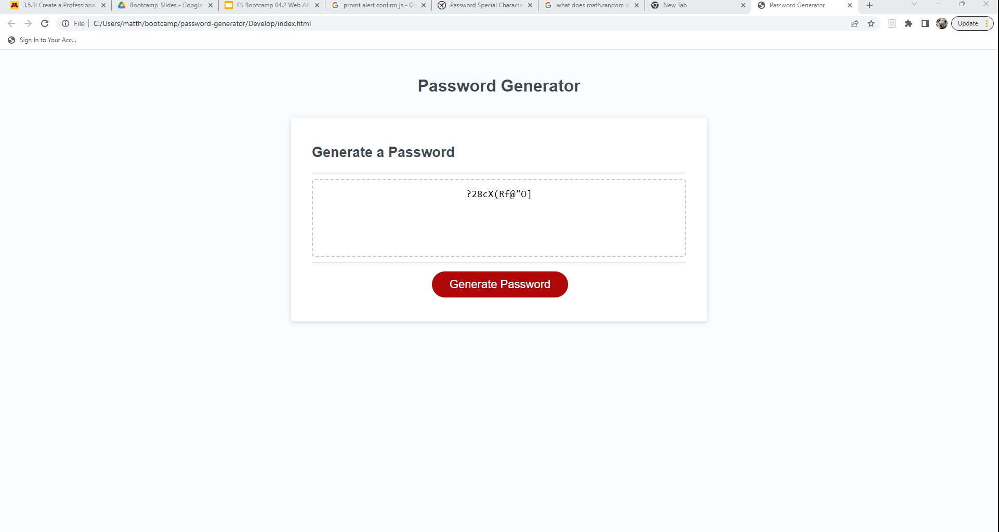

# Password-Generator

## Description

- For this bootcamp challenge I needed to make a password generator that let the user pick length and character types.
- Making the if statements ask the user what characters to fill an array was the easier problem I solved.
- Creating the for loop to run took a bit of time and I ended up asking for a litte help from family. 
- After going over it with another developer I found I was not far off track and now my understanding of for loops is much better!

## Usage

Click the 'Generate Password', select password length select characters to include and your password will be created.

## Credits

https://matth747.github.io/password-generator/ 

## License

MIT License
